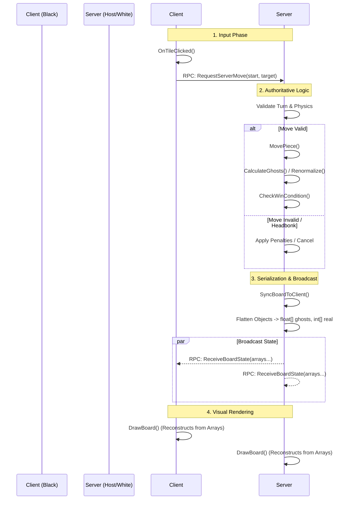

*⚠️This was my first project using **Godot** and **C#**. To prioritize rapid iteration on the complex quantum mechanics (Wave Function Collapse, Superposition), I utilized a Monolithic Architecture.*

*While the current codebase centralizes Logic, UI, and Networking in a single state manager for simplicity, future iterations would decouple the `QuantumState` logic from the `Godot.Node` visual layer for better testability.*

***Current Status:** Fully Functional Prototype.*
# Schrödinger's Chess 🐈‍⬛📦⚛️


> **A multiplayer strategy engine blending classical chess with quantum mechanics, built in C# and Godot 4.**

**Schrödinger's Chess** is a deterministic strategy game played with probabilistic information. Unlike standard chess, where information is perfect, this engine introduces **Superposition**, **Wave Function Collapse**, and **Information Entropy**. Pieces exist as probability clouds until they are observed, forcing players to manage both tactical positioning and information control.

## 🎮 Core Mechanics

The engine deviates from standard chess with four specific quantum behaviors implemented in the core logic loop:

### 1. Superposition & Scattering

Only **Kings** and **Pawns** are solid (classic). All other pieces (Rook, Knight, Bishop, Queen) enter a state of **Superposition** upon moving.

* **The Visual:** The piece disappears and generates "Ghosts" across all valid target squares.
* **The Math:** Probability mass is distributed evenly (e.g., 4 possible squares = 25% probability each).
* **The Bluff:** The *real* piece is hidden in one of these squares, but the opposing player does not know which one until an interaction occurs.

### 2. The "Headbonk" (Collision)

Movement is not guaranteed. If a player attempts to move a pawn into a square occupied by a hidden solid obstruction, the move fails. (Check [rules(link to rules document)][here(the hyperlink to the exact section inside rules)] for more information)

* **Effect:** The hidden piece is revealed (Wave Function Collapse).
* **Penalty:** The moving player's turn ends immediately.
* **Strategic Value:** You can use "solid" pieces as invisible landmines, and also use pawns as situational probes preserving probe tokens.

### 3. "Brooming" (Interference)

The code implements a **Broom Mechanic** to prevent board clutter.

* When a solid piece moves along a path, it "sweeps" away any friendly ghosts in its way.
* This cleans the board of low-value probability entropy, allowing players to consolidate their quantum state.

### 4. Probing (Observation)

Players earn **Probe Tokens** (1 token every 5 turns, max 4).

* **Right-Click** a ghost tile to spend a token.
* **Hit:** If the real piece is there, it is revealed and solidified.
* **Miss:** If the real piece is not there, that specific ghost is destroyed, and the probability mass is **Renormalized** (redistributed) to the piece's other remaining ghosts.

---

## ⚙️ Technical Architecture

This project is not just a prototype; it is a fully networked multiplayer engine.

### Networking (ENet)

* **Topology:** Server-Authoritative.
* **Implementation:** Uses `ENetMultiplayerPeer` via Godot's High-Level Multiplayer API.
* **State Sync:** The server maintains the "True Board" (`realBoard`) and the "Perceived Board" (`ghostBoard`).
* **Connection:** Currently configured for `Localhost/LAN (127.0.0.1)`.
        
     ***Note:** Can be easily adapted for WAN play using port forwarding or a relay server.*
#### RPC Flow:
1. Client sends `RequestServerMove` or `RequestServerProbe`.
2. Server validates logic, physics, and probability.
3. Server broadcasts `ReceiveBoardState` (serialized arrays of Ghost IDs and Probabilities) to sync visual states without revealing hidden truth data to clients.




### The Logic Stack

* **Ghost Normalization:** Custom floating-point math ensures total probability always sums to 1.0f after partial collapses.
* **Freezing Logic:** Tiles with >= 4 ghosts become "Frozen," acting as walls until observed.
* **Recursive Pathfinding:** Movement validation checks against both real obstacles and "High Confidence" ghosts (>99% probability).

---

## 📂 Project Structure

```text
/
├── .godot/                 # Godot internal cache (ignored)
├── assets/                 # Sprite assets (Kings, Queens, UI elements)
├── Game.tscn               # Main Game Scene (Board + UI + Networking)
├── Tile.tscn               # Prefab for a single board square
├── SchrodingerChess.cs     # ⚠️ The Monolithic Game Engine (Core Logic)
├── ChessCSharp.csproj      # .NET Project Definition
├── ChessCSharp.sln         # Visual Studio Solution
├── project.godot           # Godot Engine Configuration
└── README.md

```

## 🚀 Getting Started

### Prerequisites

* [Godot Engine 4.x (.NET Version)](https://godotengine.org/download)
* [.NET SDK 10.0](https://dotnet.microsoft.com/en-us/download) (or compatible .NET 8.0+ LTS)

### Installation

1. Clone the repository:
```bash
git clone https://github.com/AmeeteSh-A/schrodingers-chess.git

```


2. Open the project in Godot.
3. Build the C# solution within Godot (MSBuild).

## 🛠️ Tech Stack Decisions

* **Godot 4 over Unity:** Chosen for its lightweight footprint and first-class support for 2D pipelines, allowing for faster iteration on the visual layer.
* **C# (.NET) over GDScript:**
    * **Type Safety:** Critical for managing complex state objects (`Ghost`, `PieceInfo`) without runtime typing errors.
    * **Performance:** The renormalization logic involves iterating over arrays every frame; C# provides better raw computation speed for these loops.
    * **Ecosystem:** Allows usage of standard .NET collections (`List<T>`, `Dictionary`) for robust data management.

### Running the Game (Localhost Multiplayer)

The engine includes a built-in Lobby system for testing.

1. Run **two instances** of the game (Debug -> Run Multiple Instances -> 2).
2. **Instance A:** Click `HOST` (Plays as White).
3. **Instance B:** Click `JOIN` (Plays as Black).
4. **Controls:**
* **Left Click:** Select/Move Piece.
* **Right Click:** Probe a square (reveals truth).

## 📖 How to Play
This README covers the technical architecture and core concepts. For a deep dive into **Probabilistic Checkmates**, **Frozen Tiles**, and detailed **Interaction Rules**, please consult the full documentation:

👉 **[Read the Official Rules & Mechanics (rules.md)](rules.md)**

## ⚠️ Engineering Trade-offs

This project is a ***Systems Prototype*** designed to test the feasibility of probabilistic game states.

- **Monolithic State Manager:** To prioritize rapid iteration on the complex quantum mechanics, the logic engine is currently tightly coupled with the Godot Node system (SchrodingerChess.cs). Future refactoring would decouple QuantumState into a pure C# library for unit testing.
- **Floating Point Precision:** Uses standard float for probability. Rare edge cases in Renormalization (>0.99f) are clamped to 1.0f to prevent desync.
- **Network Security:** Currently runs on unencrypted ENet packets (suitable for LAN/Prototype, not Production SaaS).
- **Stateless Board Rendering:** The current render loop utilizes a "*tear-down and rebuild*" strategy (`QueueFree` followed by re-instantiation) for all 64 tiles on every state change. While this creates higher GC pressure than Object Pooling, it guarantees 100% visual consistency between the complex logic state (`realBoard`/`ghostBoard`) and the visual tree during rapid development.


## 🔮 Current Feature Set

* [x]  **Core Engine:** Movement, Scattering, and Probability logic.
* [x]  **Networking:** Lobby, RPCs, and State Synchronization.
* [x]  **Mechanics:** Headbonks, Brooming, Promotion.

## 👨‍💻 Author
Built by Ameetesh Exploring the intersection of Game Theory, Distributed Systems, and Quantum Mechanics.

## 📄 License

Distributed under the **MIT License**. See `LICENSE` for more information.
